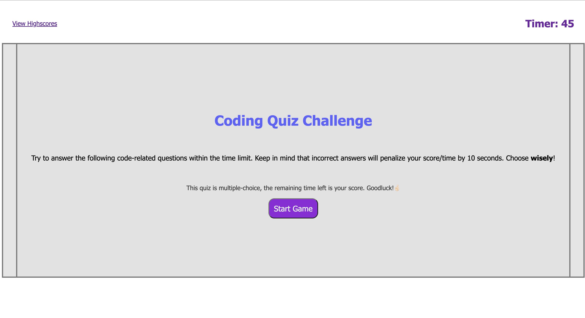
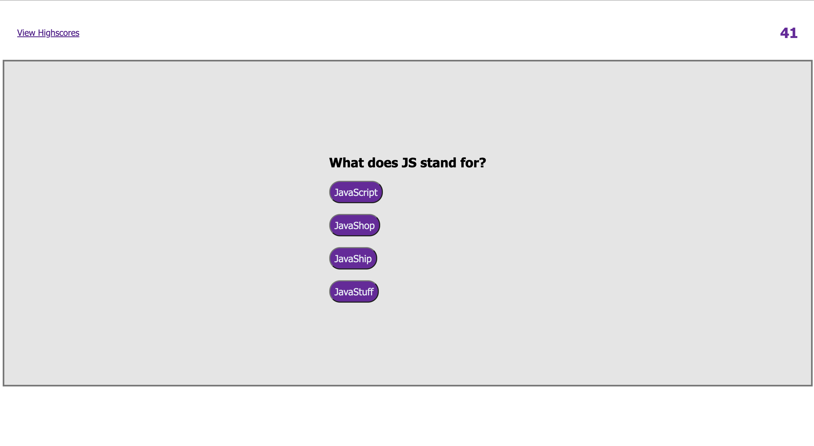
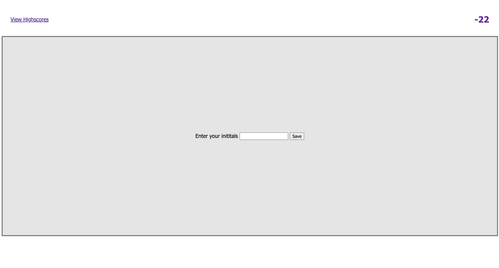

# So You Think You Can Code?

A quiz game application featuring all coding related questions.

## Description

This application is a Quiz Game Challenge against the clock! It features multiple choice questions on many topics of coding. Work your way through the questions. Selecting the correct answer will advance the player to the next question. You will be racing against the clock. Your score will be the time remaining on the countdown timer once the quiz is finished. 

I built this application so that people can not only test their knowledge of different aspects of codind but to also have fun while you learn! 

While designing this application I have learnt the importance of utilizing Client-Side Local Storage, the neccessity for clean, readable code and the importance of DOM manipulation. I look forward to designing and building future applications to aid learning for budding developers.

## Installation

To use this application you need to open the following link in your browser 

 https://eddiespag-hetti.github.io/Coding_Quiz/ 

## Usage

This application is user-friendly and easy to use. Once you have navigated to the page, all you need to too is put your thinking cap on and click "Start Game" to load the first question and begin the countdown timer.

You will then be asked a series of coding related multiple choice questions. Take note that each inncorrect answer will deduct 10 seconds from the time, so choose wisely. With each correct answer the quiz will advance one question. Your 'High Score' will the time remaining on the timer once all the questions are answered. Enter your initials to log your score.

    
   
 

 

  
  
  

   

## License

Please see the license associated with this Repository

## Features

This application offers a chance to test your knowledge of all things coding. Beat the clock and claim your place on the scoreboard! 

